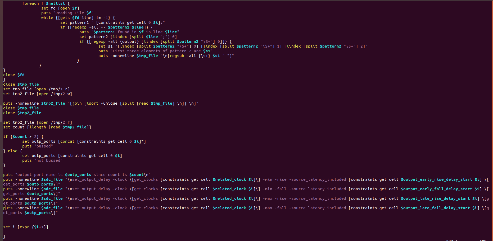

# TCL WORKSHOP - Introduction to Advanced Scripting Techniques in Design and Synthesis

# About

A comprehensive 5 day training workshop that is designed to ignite your passion for TCL and equip you with the skills needed to excel in advanced scripting techniques required in the realm of EDA. 

Workshop conducted by VLSI System Design : [VSD website](https://www.vlsisystemdesign.com/)

# Outline

1. [Introduction](#1-introduction)
2. [Synth Toolbox](#2-synth-toolbox)
2.1 [Usage Scenario 1](#21-usage-scenario-1)
2.2 [Usage Scenario 2 & 3](#22-usage-scenario-2-and-3)
3. [Variable Creation](#3-variable-creation)
4. [Processing constraints from the CSV File](#4-processing-constraints-from-the-csv-file)
5. [Processing clock constraints](#5-processing-clock-constraints)
6. [Processing input constraints](#6-processing-input-constraints)
7. [Processing output constraints](#7-processing-output-constraints)
8. [Yosys](#8-yosys)
9. [Hierarchy Check](#9-hierarchy-check)
10. [Synthesis using Yosys](#10-synthesis-using-yosys)
11. [Procs](#11-procs)
12. [Netlist and SDC processing for Opentimer](#12-netlist-and-sdc-processing-for-opentimer)
13. [Static Timing Analysis (STA) and Quality of Results (QOR)](#13-static-timing-analysis-sta-and-quality-of-results-qor)
14. [Conclusion](#14-conclusion)

[Acknowledgement](#acknowledgement)

[Bibliography](#bibliography)

# 1. Introduction

The name Tcl is derived from "Tool Command Language" and is pronounced "tickle". Tcl is a radically simple open-source interpreted programming language that provides common facilities such as variables, procedures, and control structures as well as many useful features that are not found in any other major language.

For Electronic Design Automation (EDA) applications, TCL has emerged as the de facto industry standard embedded command language. TCL is the ideal option if you need to automate repetitive behavior, expand an application’s capabilities, manage many tools with a single script, or develop a unique GUI.

In this report, a TCL toolbox is created to process a verilog design. Design details and constraints were extracted and the design was synthesised using Yosys. The synthesis output and the SDC were further processed to be fed into the OpenTimer tool for Static Timing Analysis (STA). The prelayout STA results were inferred from the results file and printed to the user.
 
# 2. Synth Toolbox

| .png) |
|:--:|
| Fig. 1 Creation of vsdsynth file amd addition of first line for shell scripting |

| .png) |
|:--:|
| Fig. 2 Verifying the creation of file using vim |

| .png) |
|:--:|
| Fig. 3 Making the file executable and checking the acccess modification |
 
## 2.1 Usage Scenario 1

| .png) |
|:--:|
| Fig. 4 Script to check if a file is provided|

| .png) |
|:--:|
| Fig. 5 Checking both use cases - file not given and file given |

## 2.2 Usage Scenario 2 and 3

| .png) |
|:--:|
| Fig. 6 Scripts for scenario 2 - user invoking help menu - and scenario 3 - user providing a CSV file that does not exits|

| .png) |
|:--:|
| Fig. 7 Verification of scenarios 2 and 3|

# 3. Variable Creation 

| .png) |
|:--:|
| Fig. 8 Creation of .tcl script |

| .png) |
|:--:|
| Fig. 9 Verifyinf creation of file using vim |

| .png) |
|:--:|
| Fig. 10 Invoking the tcl script within the shell script |

| .png) |
|:--:|
| Fig. 11 Sample CSV file containing the design details required by the script |
 
| .png) |
|:--:|
| Fig. 12 TCL file containing the logic of extracting CSV data and auto-creating variables |
 
| .png) |
|:--:|
| Fig. 13 Verification of variable creation and it's contents |
 
| .png) |
|:--:|
| Fig. 14 Script to verify variable name and contents |
 
| .png) |
|:--:|
| Fig. 15 Verification of variable name and contents |
 
| .png) |
|:--:|
| Fig. 16 Script to check the correctness of details provided in the CSV file |
 
| .png) |
|:--:|
| Fig. 17 Verification of details - if a wrong path was provided, the script would have thrown an error and exited right away |

# 4. Processing constraints from the CSV File

| .png) |
|:--:|
| Fig. 18 Script to create the CSV file as a matrix, convert into an array and identify number of rows and columns |
 
| .png) |
|:--:|
| Fig. 19 Verification of matrix creation, array creation and count of R and C|

| .png) |
|:--:|
| Fig. 20 Script to extract the positions of port details' start point|
 
| .png) |
|:--:|
| Fig. 21 Verification of the indices |

| .png) |
|:--:|
| Fig. 22 Snip of the constraints CSV file to cross-check |

| .png) |
|:--:|
| Fig. 23 Script to identify start of a particular parameter - clocks' early rise delay in this case |
 
| .png) |
|:--:|
| Fig. 24 Verification of the index |

| .png) |
|:--:|
| Fig. 25 Script to idetify multiple parameters|
 
| .png) |
|:--:|
| Fig. 26 Verification of the above case |
 
# 5. Processing clock constraints

| .png) |
|:--:|
| Fig. 27 Script to extract clock constraints in the format that yosys accepts|

| .png) |
|:--:|
| Fig. 28 Verification of working of the code |
 
| .png) |
|:--:|
| Fig. 29 Only the create clock of Fig. 27 was tested and the above output was verified |
 
| .png) |
|:--:|
| Fig. 30 Successful extration of all clock related constraints |

# 6. Processing input constraints

| .png) |
|:--:|
| Fig. 31 Script to extract 1. Input latency and slew; 2. Bussed and bit ports using pattern searching |

| .png) |
|:--:|
| Fig. 32 Continuation of Fig. 31 - appending the port name with * if bussed and dumping values into SDC file |

| .png) |
|:--:|
| Fig. 33 Successful identification and modification of bussed ports  |
 
| .png) |
|:--:|
| Fig. 34 Path to access sdc file |

# 7. Processing output constraints

|  |
|:--:|
| Fig. 35 Script to extract output constraints |

| .png) |
|:--:|
| Fig. 36  Successful extraction of clock, input and output constraints in the SDC format |
 
| .png) |
|:--:|
| Fig. 37 Illustration of bussed and unbussed output ports |
 
| .png) |
|:--:|
| Fig. 38 Output constraints in SDC format - can be viewed using commands in Fig. 34|

# 8. Yosys

Yosys is the first full-featured open source software for Verilog HDL synthesis. It supports most of Verilog-2005 and is well tested with real-world designs from the ASIC and FPGA world.

Synthesis using Yosys can be well understood from [my report here](https://github.com/jargonized/sky130RTLDesignandSynthesisWorkshop)

# 9. Hierarchy Check

| .png) |
|:--:|
| Fig. 39 Script to run hierarchy check - check if all modules referenced within the top module is valid |

| .png) |
|:--:|
| Fig. 40 Successful verification that modules are present |
 
| .png) |
|:--:|
| Fig. 40 (i) - Hierarchy check log file. |
 
| .png) |
|:--:|
| Fig. 40 (ii) - Hierarchy check PASS - verified from log |
 
| .png) |
|:--:|
| Fig. 41 Module name modified to check the error handling |
 
| .png) |
|:--:|
| Fig. 42 Error flag set to 1, thus the check works |
 
| .png) |
|:--:|
| Fig. 43 Error captured in the log file |
 
| .png) |
|:--:|
| Fig. 44 Debugging statements printed to identify and modify hierarchy faults |
 
| .png) |
|:--:|
| Fig. 45 Heirarchy PASS after rectifying the error |

# 10. Synthesis using Yosys

| .png) |
|:--:|
| Fig. 46 Script to run synthesis using yosys - which creates a script to feed to the yosys tool |
 
| .png) |
|:--:|
| Fig. 47 Successful creation of yosys script |
 
| .png) |
|:--:|
| Fig. 48 Preview of the yosys script |
 
| .png) |
|:--:|
| Fig. 49 Script to invoke yosys tool with our design and catch errors |
 
| .png) |
|:--:|
| Fig. 50  Successful synthesis |
 
| .png) |
|:--:|
| Fig. 51 Snip of the synthesis log |

# 11. Procs

Procedures are nothing but code blocks with series of commands that provide a specific reusable functionality. It is used to avoid same code being repeated in multiple locations. Procedures are equivalent to the functions used in many programming languages and are made available in Tcl with the help of proc command.

| .png) |
|:--:|
| Fig. 52 Proc to set library files for STA|
 
| .png) |
|:--:|
| Fig. 53 (i) Proc to modify SDC constraints to suit Opentimer requirements |
 
| .png) |
|:--:|
| Fig. 53 (ii) contd. |
 
| .png) |
|:--:|
| Fig. 53 (iiI) contd. |
 
| .png) |
|:--:|
| Fig. 53 (iv) contd. |
 
| .png) |
|:--:|
| Fig. 54 Proc to set netlist directory |
 
| .png) |
|:--:|
| Fig. 55 Proc to set Standard Output|
 
| .png) |
|:--:|
| Fig. 56 Proc to set number of threads for Opentimer to access while running |
 
| .png) |
|:--:|
| Fig. 57 Sample TCl script to illustrate use of a proc |
 
| .png) |
|:--:|
| Fig. 58 Execution of the test script |

# 12. Netlist and SDC processing for Opentimer

| .png) |
|:--:|
| Fig. 59 (i) Verilog file generated after synthesis. Contains * and \ which are unwanted - needs to be removed before its fed into Opentimer |
 
| .png) |
|:--:|
| Fig. 59 (ii) Unwanted "\" encountered |

| .png) |
|:--:|
| Fig. 60 Script to remove unwanted lines and characters|
 
| .png) |
|:--:|
| Fig. 61 Successful netlist preparation for STA |

| .png) |
|:--:|
| Fig. 62 Script to use procs to process constraints in the SDC file and prepare the .spef and .conf file for Opentimer |
 
| .png) |
|:--:|
| Fig. 63 Successful preparation of files required |
 
# 13. Static Timing Analysis (STA) and Quality of Results (QOR)

| .png) |
|:--:|
| Fig. 64 Script to invoke Opentimer and dump log and results |

| .png) |
|:--:|
| Fig. 65 Result file generated by Opentimer |
 
| .png) |
|:--:|
| Fig. 66 (i) Script to extract parameters from results file |
 
| .png) |
|:--:|
| Fig. 66 (ii) contd and script to format results while displaying|

| .png) |
|:--:|
| Fig. 67 Final Result |

# 14. Conclusion

A TCL toolbox was created to which the design details were fed. The design details were extracted. The constraints given were processed to suit the requirements of the yosys tool. Synthesis was carried out using yosys. The synthesised netlist was modified to suit the needs of Opentimer. The SDC constraints were processed using procs to suit the Opentimer model. Static Timing Analysis (STA) was performed and the results were extracted and formatted and finnaly displayed to the user.

# Acknowledgement

The above work was carried out as a part of the 5-day workshop on TCL Programming organised by VLSI System Design. I am greatly indebted to Kunal Ghosh (course instructor), Geetima Kachari (TA) and the entire VSD Team for this great learning experience and immense guidance provided throughout the workshop.

# Bibliography

1. [TCL in VLSI](https://chipedge.com/tcl-scripting-for-vlsi-a-brief-guide/#:~:text=TCL%20(Tool%20Command%20Language)%20is,tools%20are%20built%20on%20it.)
2. [Yosys PPT](https://opencores.org/websvn/filedetails?repname=socgen&path=%2Fsocgen%2Ftrunk%2Ftools%2Fyosys%2Fyosys_presentation.pdf)
3. [More on Procs](https://www.tutorialspoint.com/tcl-tk/tcl_procedures.htm)

